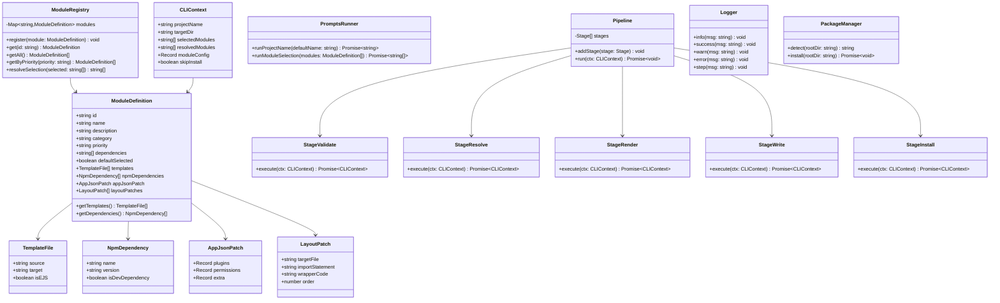
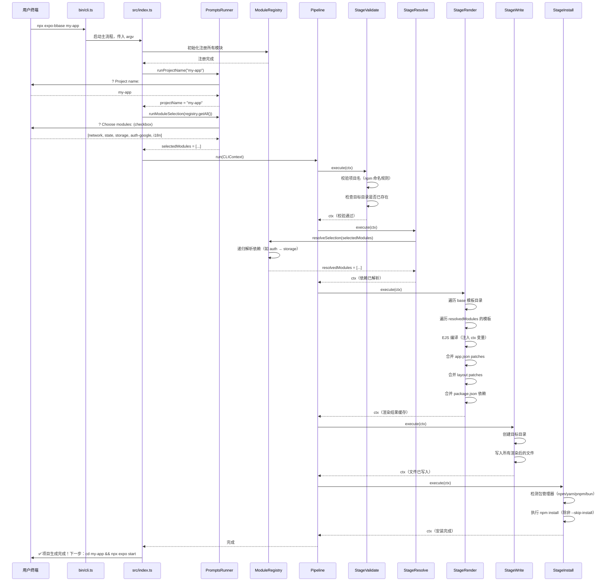
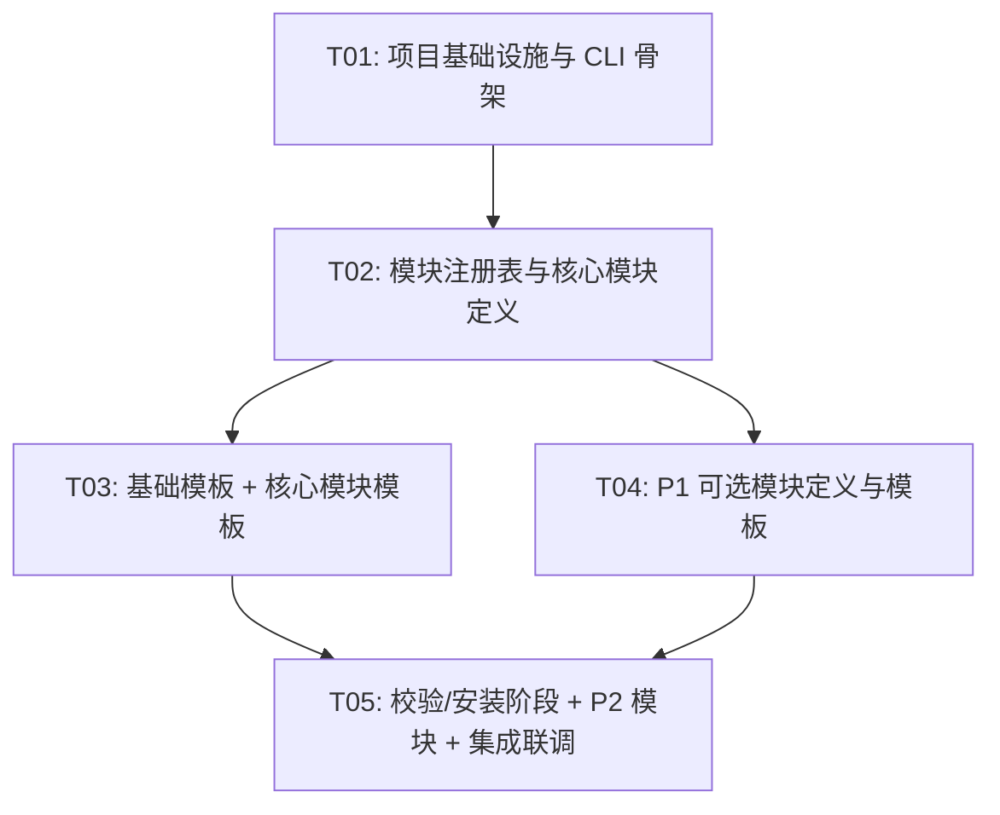

# expo-bbase 系统架构设计文档

> 版本：v1.0 | 作者：高见远（Gao）· 架构师 | 日期：2025-07-09

---

## Part A：系统设计

### 1. 实现方案与框架选型

#### 1.1 核心技术挑战

| 挑战 | 说明 | 解决方案 |
|------|------|----------|
| 模板条件生成 | 用户选择不同模块组合，需动态拼装文件和依赖 | 声明式模块注册表 + EJS 模板引擎，每个模块声明自己需要的文件、依赖、配置片段 |
| 模块间依赖 | 某些模块存在隐式依赖（如登录模块依赖存储模块） | 模块定义中声明 `dependencies` 字段，CLI 自动补选依赖模块 |
| 生成代码质量 | 生成项目必须可直接运行，不能有未解析引用 | 模板中使用 EJS 条件编译，未选模块的引用代码不写入；生成后做引用完整性校验 |
| Expo 配置合并 | 部分模块需要修改 `app.json` 的 plugins/permissions | 模块声明 `appJsonPatch`，CLI 合并所有已选模块的 patch |
| 性能体验 | CLI 交互需流畅，大文件拷贝不卡顿 | 流式文件写入 + ora spinner，npm install 支持跳过 |

#### 1.2 框架选型

**CLI 工具层**：

| 包 | 版本 | 用途 | 选型理由 |
|---|---|---|---|
| commander | ^12.0 | 命令行参数解析 | 社区标准，支持子命令、选项、自动帮助 |
| prompts | ^2.4 | 交互式提问（项目名、模块选择） | 轻量、支持 checkbox multiselect，比 inquirer 更小 |
| chalk | ^5.3 | 终端彩色输出 | 社区标准，ESM 原生支持 |
| ora | ^8.0 | 终端 spinner | 友好的进度提示，与 chalk 配合 |
| fs-extra | ^11.2 | 文件操作增强 | 支持 ensureDir/copy/emptyDir 等，比原生 fs 更安全 |
| ejs | ^3.1 | 模板引擎 | 轻量、成熟，支持条件编译和变量注入 |
| execa | ^9.0 | 子进程执行 | 替代 child_process，Promise 化，更好的错误处理 |
| validate-npm-package-name | ^4.0 | 项目名校验 | npm 官方包名规则验证 |
| fast-glob | ^3.3 | 模板文件扫描 | 快速递归扫描模板目录 |
| rimraf | ^5.0 | 目录删除 | 跨平台安全删除 |

**生成项目依赖（基础模板）**：

| 包 | 版本 | 用途 |
|---|---|---|
| expo | ~54.0 | Expo SDK 核心 |
| react | ^19.0 | React 核心 |
| react-native | ~0.79 | React Native 运行时 |
| expo-router | ~4.0 | 文件路由 |
| nativewind | ^4.0 | Tailwind CSS for RN |
| tailwindcss | ^3.4 | Tailwind CSS 核心 |
| zustand | ^5.0 | 状态管理 |
| @tanstack/react-query | ^5.0 | 网络请求/缓存 |
| react-native-mmkv | ^3.0 | 本地存储 |
| typescript | ^5.5 | 类型系统 |

**生成项目依赖（可选模块）**：

| 模块 | 包 |
|---|---|
| Apple 支付 | react-native-iap |
| 表单验证 | react-hook-form, @hookform/resolvers, zod |
| 图片 | expo-image |
| 视频 | expo-av |
| Google 登录 | @react-native-google-signin/google-signin |
| Facebook 登录 | expo-facebook |
| Apple 登录 | expo-apple-authentication |
| WebView | react-native-webview |
| 多语言 | i18next, react-i18next, expo-localization |
| 动画/手势 | react-native-reanimated, react-native-gesture-handler |
| OTA | expo-updates |
| 通知 | expo-notifications |
| Bottom Sheet | @gorhom/bottom-sheet |
| FlashList | @shopify/flash-list |
| UI 组件库 | reactnative.reusables 相关包 |

#### 1.3 架构模式

CLI 工具采用 **管道（Pipeline）+ 插件（Plugin）** 架构：

```
用户输入 → 校验 → 模块解析 → 模板渲染 → 文件写入 → 依赖安装 → 完成
```

- **管道**：CLI 执行流程分为多个阶段（Stage），每个阶段职责单一，可独立测试
- **插件**：每个功能模块是一个"插件"，声明自己的文件模板、依赖、配置补丁，注册到模块注册表
- **模板引擎**：使用 EJS 做条件编译，根据用户选择动态生成代码

---

### 2. 文件列表

#### 2.1 CLI 工具自身文件

```
expo-bbase/
├── bin/
│   └── cli.ts                         # CLI 入口（#!/usr/bin/env node）
├── src/
│   ├── index.ts                       # 主流程编排
│   ├── prompts/
│   │   └── index.ts                   # 交互式提问逻辑（项目名、模块选择）
│   ├── stages/
│   │   ├── validate.ts                # 阶段1：输入校验（项目名、目录冲突）
│   │   ├── resolve.ts                 # 阶段2：模块依赖解析与补选
│   │   ├── render.ts                  # 阶段3：模板渲染（EJS 编译）
│   │   ├── write.ts                   # 阶段4：文件写入目标目录
│   │   └── install.ts                 # 阶段5：npm install
│   ├── modules/
│   │   ├── registry.ts                # 模块注册表（所有模块定义的集合）
│   │   ├── types.ts                   # 模块定义类型（ModuleDefinition）
│   │   ├── core/
│   │   │   ├── router.ts              # Expo Router 模块定义
│   │   │   ├── nativewind.ts          # NativeWind 模块定义
│   │   │   ├── network.ts             # TanStack Query 网络请求模块定义
│   │   │   ├── state.ts               # Zustand 状态管理模块定义
│   │   │   └── storage.ts             # MMKV 存储模块定义
│   │   ├── optional/
│   │   │   ├── auth.ts                # 登录模块定义（Google/FB/Apple）
│   │   │   ├── payment.ts             # Apple 支付模块定义
│   │   │   ├── form.ts                # 表单验证模块定义
│   │   │   ├── image.ts               # 图片模块定义
│   │   │   ├── video.ts               # 视频模块定义
│   │   │   ├── webview.ts             # WebView 模块定义
│   │   │   ├── i18n.ts                # 多语言模块定义
│   │   │   ├── animation.ts           # 动画/手势模块定义
│   │   │   ├── ota.ts                 # OTA 更新模块定义
│   │   │   ├── notification.ts        # 通知模块定义
│   │   │   ├── permission.ts          # 权限管理模块定义
│   │   │   ├── bottom-sheet.ts        # Bottom Sheet 模块定义
│   │   │   ├── flashlist.ts           # FlashList 模块定义
│   │   │   └── reusables.ts           # reactnative.reusables 模块定义
│   │   └── index.ts                   # 模块统一导出
│   ├── utils/
│   │   ├── logger.ts                  # 日志工具（chalk 封装）
│   │   ├── fs.ts                      # 文件操作工具（fs-extra 封装）
│   │   └── package-manager.ts         # 包管理器检测（npm/yarn/pnpm/bun）
│   └── constants.ts                   # 常量定义（版本号、默认模块列表等）
├── templates/
│   ├── base/                          # 基础项目模板（所有项目都有）
│   │   ├── app/
│   │   │   ├── _layout.tsx.ejs
│   │   │   ├── (tabs)/
│   │   │   │   ├── _layout.tsx.ejs
│   │   │   │   ├── index.tsx.ejs
│   │   │   │   └── explore.tsx.ejs
│   │   │   └── +not-found.tsx.ejs
│   │   ├── src/
│   │   │   ├── components/
│   │   │   │   └── .gitkeep
│   │   │   ├── hooks/
│   │   │   │   └── .gitkeep
│   │   │   ├── utils/
│   │   │   │   └── index.ts.ejs
│   │   │   └── types/
│   │   │       └── index.ts.ejs
│   │   ├── assets/
│   │   │   └── .gitkeep
│   │   ├── app.json.ejs
│   │   ├── package.json.ejs
│   │   ├── tsconfig.json.ejs
│   │   ├── tailwind.config.js.ejs
│   │   ├── metro.config.js.ejs
│   │   ├── babel.config.js
│   │   ├── .gitignore.ejs
│   │   └── README.md.ejs
│   └── modules/                       # 模块模板（按模块组织）
│       ├── network/
│       │   ├── src/api/client.ts.ejs
│       │   ├── src/api/interceptors.ts.ejs
│       │   └── src/api/types.ts.ejs
│       ├── state/
│       │   ├── src/stores/index.ts.ejs
│       │   └── src/stores/slices/app-slice.ts.ejs
│       ├── storage/
│       │   └── src/storage/index.ts.ejs
│       ├── auth/
│       │   ├── src/modules/auth/index.ts.ejs
│       │   ├── src/modules/auth/providers/google.ts.ejs
│       │   ├── src/modules/auth/providers/facebook.ts.ejs
│       │   ├── src/modules/auth/providers/apple.ts.ejs
│       │   ├── src/modules/auth/hooks/useAuth.ts.ejs
│       │   └── src/modules/auth/types.ts.ejs
│       ├── payment/
│       │   ├── src/modules/payment/index.ts.ejs
│       │   ├── src/modules/payment/hooks/usePayment.ts.ejs
│       │   └── src/modules/payment/types.ts.ejs
│       ├── form/
│       │   ├── src/modules/form/index.ts.ejs
│       │   └── src/modules/form/schemas/example.ts.ejs
│       ├── image/
│       │   ├── src/modules/media/image/index.ts.ejs
│       │   └── src/modules/media/image/components/CachedImage.tsx.ejs
│       ├── video/
│       │   ├── src/modules/media/video/index.ts.ejs
│       │   └── src/modules/media/video/components/VideoPlayer.tsx.ejs
│       ├── webview/
│       │   ├── src/modules/webview/index.ts.ejs
│       │   ├── src/modules/webview/components/BridgeWebView.tsx.ejs
│       │   └── src/modules/webview/bridge/types.ts.ejs
│       ├── i18n/
│       │   ├── src/modules/i18n/index.ts.ejs
│       │   ├── src/modules/i18n/locales/en.json
│       │   └── src/modules/i18n/locales/zh.json
│       ├── animation/
│       │   ├── src/modules/animation/index.ts.ejs
│       │   └── src/modules/animation/utils.ts.ejs
│       ├── ota/
│       │   └── src/modules/ota/index.ts.ejs
│       ├── notification/
│       │   ├── src/modules/notification/index.ts.ejs
│       │   └── src/modules/notification/components/InAppNotification.tsx.ejs
│       ├── permission/
│       │   └── src/modules/permission/index.ts.ejs
│       ├── bottom-sheet/
│       │   └── src/modules/ui/bottom-sheet/index.ts.ejs
│       ├── flashlist/
│       │   ├── src/modules/ui/flashlist/index.ts.ejs
│       │   └── src/modules/ui/flashlist/components/FlashListWrapper.tsx.ejs
│       └── reusables/
│           └── src/modules/ui/reusables/index.ts.ejs
├── package.json
├── tsconfig.json
└── README.md
```

#### 2.2 生成项目文件（以全选为例）

```
my-app/
├── app/
│   ├── _layout.tsx                    # 根布局（含 providers 包装）
│   ├── (tabs)/
│   │   ├── _layout.tsx                # Tab 布局
│   │   ├── index.tsx                  # 首页
│   │   └── explore.tsx               # 探索页
│   └── +not-found.tsx                # 404
├── src/
│   ├── api/                          # 网络请求（可选）
│   │   ├── client.ts                 # 请求客户端
│   │   ├── interceptors.ts           # 拦截器
│   │   └── types.ts                  # 请求/响应类型
│   ├── stores/                       # 状态管理（可选）
│   │   ├── index.ts                  # Store 汇总导出
│   │   └── slices/
│   │       └── app-slice.ts          # App 示例 Slice
│   ├── storage/                      # 本地存储（可选）
│   │   └── index.ts                  # MMKV 封装
│   ├── modules/
│   │   ├── auth/                     # 登录模块（可选）
│   │   │   ├── index.ts
│   │   │   ├── providers/
│   │   │   │   ├── google.ts
│   │   │   │   ├── facebook.ts
│   │   │   │   └── apple.ts
│   │   │   ├── hooks/
│   │   │   │   └── useAuth.ts
│   │   │   └── types.ts
│   │   ├── payment/                  # 支付模块（可选）
│   │   │   ├── index.ts
│   │   │   ├── hooks/
│   │   │   │   └── usePayment.ts
│   │   │   └── types.ts
│   │   ├── webview/                  # WebView（可选）
│   │   │   ├── index.ts
│   │   │   ├── components/
│   │   │   │   └── BridgeWebView.tsx
│   │   │   └── bridge/
│   │   │       └── types.ts
│   │   ├── i18n/                     # 多语言（可选）
│   │   │   ├── index.ts
│   │   │   └── locales/
│   │   │       ├── en.json
│   │   │       └── zh.json
│   │   ├── media/                    # 媒体（可选）
│   │   │   ├── image/
│   │   │   │   ├── index.ts
│   │   │   │   └── components/
│   │   │   │       └── CachedImage.tsx
│   │   │   └── video/
│   │   │       ├── index.ts
│   │   │       └── components/
│   │   │           └── VideoPlayer.tsx
│   │   ├── animation/               # 动画（可选）
│   │   │   ├── index.ts
│   │   │   └── utils.ts
│   │   └── ui/                       # UI 组件（可选）
│   │       ├── bottom-sheet/
│   │       │   └── index.ts
│   │       ├── flashlist/
│   │       │   ├── index.ts
│   │       │   └── components/
│   │       │       └── FlashListWrapper.tsx
│   │       └── reusables/
│   │           └── index.ts
│   ├── components/                   # 通用组件
│   ├── hooks/                        # 自定义 Hooks
│   ├── utils/
│   │   └── index.ts
│   └── types/
│       └── index.ts
├── assets/
├── app.json
├── package.json
├── tsconfig.json
├── tailwind.config.js
├── metro.config.js
├── babel.config.js
├── .gitignore
└── README.md
```

---

### 3. 数据结构与接口



#### 关键接口说明

**ModuleDefinition**：每个功能模块的声明式定义，是整个系统的核心数据结构。

```typescript
interface ModuleDefinition {
  id: string;                    // 唯一标识，如 'network', 'auth-google'
  name: string;                  // 显示名称，如 'Network Request (TanStack Query)'
  description: string;           // 模块说明
  category: 'core' | 'optional'; // 分类
  priority: 'P0' | 'P1' | 'P2'; // 优先级
  dependencies: string[];        // 依赖的其他模块 id
  defaultSelected: boolean;      // 是否默认选中
  templates: TemplateFile[];     // 模板文件列表
  npmDependencies: NpmDependency[]; // npm 依赖
  appJsonPatch?: AppJsonPatch;   // app.json 补丁
  layoutPatches?: LayoutPatch[]; // _layout.tsx 补丁（provider 注入）
}

interface TemplateFile {
  source: string;  // 模板源路径（相对于 templates/ 目录）
  target: string;  // 生成目标路径（相对于项目根目录）
  isEJS: boolean;  // 是否需要 EJS 渲染
}

interface NpmDependency {
  name: string;
  version: string;
  isDevDependency: boolean;
}

interface AppJsonPatch {
  plugins?: Record<string, any>;   // expo plugins
  permissions?: string[];          // iOS/Android 权限
  extra?: Record<string, any>;     // extra 配置
}

interface LayoutPatch {
  targetFile: string;        // 要 patch 的 layout 文件，如 'app/_layout.tsx'
  importStatement: string;   // 要添加的 import 语句
  wrapperCode: string;       // 要包裹的 provider wrapper
  order: number;             // provider 嵌套顺序（越小越外层）
}

interface CLIContext {
  projectName: string;
  targetDir: string;
  selectedModules: string[];      // 用户原始选择
  resolvedModules: string[];      // 解析依赖后的完整模块列表
  moduleConfig: Record<string, any>; // 模块特定配置（如登录方式选择）
  skipInstall: boolean;
}
```

---

### 4. 程序调用流程



---

### 5. 待明确事项

| 编号 | 问题 | 影响范围 | 当前假设 |
|------|------|----------|----------|
| E1 | 登录模块中 Google/Facebook/Apple 是否作为独立可选子模块，还是作为登录模块的配置项？ | 模块定义粒度、CLI 交互复杂度 | **假设**：登录模块内部子选项，用户选了登录模块后再选具体登录方式（二级选择） |
| E2 | 生成项目的 `app/_layout.tsx` 中 Provider 嵌套顺序如何确定？ | 运行时行为 | **假设**：按 LayoutPatch.order 排序，order 越小越外层。默认：i18n(10) → QueryClient(20) → Store(30) → Auth(40) → Notification(50) |
| E3 | 模块模板中是否需要提供示例页面（如登录页、支付页）？ | 生成项目体积和开箱即用性 | **假设**：P0/P1 模块提供最小可运行示例代码，不含完整页面 |
| E4 | `reactnative.reusables` 的安装方式尚未明确（npm 包还是复制源码） | 模板文件组织 | **假设**：通过 npm 安装，生成项目中仅提供使用示例 |
| E5 | 现有项目增量集成（P2-7）是否需要在首版 CLI 中预留扩展点？ | CLI 架构设计 | **假设**：首版 CLI 入口参数预留 `--mode=add` 扩展点，但实现仅为 `create` 模式 |
| E6 | 是否需要生成项目的单元测试模板？ | 生成项目完整性 | **假设**：首版不包含，P2 迭代 |

---

## Part B：任务分解

### 6. 依赖包列表

#### CLI 工具依赖

```bash
# 生产依赖
commander@^12.0.0        # 命令行参数解析
prompts@^2.4.2           # 交互式提问
chalk@^5.3.0             # 终端彩色输出
ora@^8.0.1               # 终端 spinner
fs-extra@^11.2.0         # 文件操作增强
ejs@^3.1.10              # 模板引擎
execa@^9.2.0             # 子进程执行
validate-npm-package-name@^4.0.0  # 项目名校验
fast-glob@^3.3.2         # 文件扫描
rimraf@^5.0.7            # 目录删除

# 开发依赖
typescript@^5.5.0        # TypeScript
tsup@^8.1.0              # 构建打包
@types/fs-extra@^11.0.4  # 类型定义
@types/prompts@^2.4.9    # 类型定义
@types/ejs@^3.1.5        # 类型定义
prettier@^3.3.0          # 代码格式化
```

#### 生成项目依赖（由模板动态生成）

```bash
# 核心依赖（所有项目）
expo@~54.0.0
react@^19.0.0
react-native@~0.79.0
typescript@^5.5.0
expo-router@~4.0.0
nativewind@^4.0.0
tailwindcss@^3.4.0

# 可选依赖（按模块选择）
zustand@^5.0.0                              # state
@tanstack/react-query@^5.0.0                # network
react-native-mmkv@^3.0.0                    # storage
react-native-iap@^12.0.0                    # payment
react-hook-form@^7.52.0                     # form
@hookform/resolvers@^3.9.0                  # form
zod@^3.23.0                                 # form
expo-image@~2.0.0                           # image
expo-av@~15.0.0                             # video
@react-native-google-signin/google-signin@^12.0.0  # auth-google
expo-facebook@^18.0.0                       # auth-facebook
expo-apple-authentication@~7.0.0            # auth-apple
react-native-webview@^13.0.0                # webview
i18next@^23.11.0                            # i18n
react-i18next@^14.1.0                       # i18n
expo-localization@~16.0.0                   # i18n
react-native-reanimated@^3.12.0             # animation
react-native-gesture-handler@^2.17.0        # animation
expo-updates@~0.26.0                        # ota
expo-notifications@~0.29.0                  # notification
@gorhom/bottom-sheet@^5.0.0                 # bottom-sheet
@shopify/flash-list@^1.7.0                  # flashlist
```

---

### 7. 任务列表

```json
[
  {
    "id": "T01",
    "title": "项目基础设施与 CLI 骨架",
    "description": "搭建 CLI 工具项目结构：package.json、tsconfig、构建配置、bin 入口、主流程编排（Pipeline）、常量定义、Logger/FS 工具函数、PackageManager 检测。确保 `npx expo-bbase --help` 可正常运行。",
    "dependencies": [],
    "priority": "P0",
    "files": [
      "package.json",
      "tsconfig.json",
      "bin/cli.ts",
      "src/index.ts",
      "src/constants.ts",
      "src/utils/logger.ts",
      "src/utils/fs.ts",
      "src/utils/package-manager.ts"
    ]
  },
  {
    "id": "T02",
    "title": "模块注册表与核心模块定义",
    "description": "实现 ModuleDefinition 类型、ModuleRegistry 注册/解析逻辑、所有 P0 核心模块定义（router、nativewind、network、state、storage）以及 PromptsRunner 交互逻辑。完成模块选择 → 依赖解析的完整流程。",
    "dependencies": ["T01"],
    "priority": "P0",
    "files": [
      "src/modules/types.ts",
      "src/modules/registry.ts",
      "src/modules/core/router.ts",
      "src/modules/core/nativewind.ts",
      "src/modules/core/network.ts",
      "src/modules/core/state.ts",
      "src/modules/core/storage.ts",
      "src/modules/index.ts",
      "src/prompts/index.ts"
    ]
  },
  {
    "id": "T03",
    "title": "基础模板 + 核心模块模板",
    "description": "编写 base 模板文件（app.json.ejs、package.json.ejs、_layout.tsx.ejs、tsconfig.json.ejs、tailwind.config.js.ejs、metro.config.js.ejs、.gitignore.ejs、README.md.ejs 等）和 P0 核心模块的模板文件（api/、stores/、storage/）。实现 Render Stage（EJS 编译 + app.json 合并 + layout patches 合并）和 Write Stage（文件写入）。",
    "dependencies": ["T02"],
    "priority": "P0",
    "files": [
      "src/stages/render.ts",
      "src/stages/write.ts",
      "templates/base/app/_layout.tsx.ejs",
      "templates/base/app/(tabs)/_layout.tsx.ejs",
      "templates/base/app/(tabs)/index.tsx.ejs",
      "templates/base/app/(tabs)/explore.tsx.ejs",
      "templates/base/app/+not-found.tsx.ejs",
      "templates/base/app.json.ejs",
      "templates/base/package.json.ejs",
      "templates/base/tsconfig.json.ejs",
      "templates/base/tailwind.config.js.ejs",
      "templates/base/metro.config.js.ejs",
      "templates/base/babel.config.js",
      "templates/base/.gitignore.ejs",
      "templates/base/README.md.ejs",
      "templates/base/src/utils/index.ts.ejs",
      "templates/base/src/types/index.ts.ejs",
      "templates/modules/network/src/api/client.ts.ejs",
      "templates/modules/network/src/api/interceptors.ts.ejs",
      "templates/modules/network/src/api/types.ts.ejs",
      "templates/modules/state/src/stores/index.ts.ejs",
      "templates/modules/state/src/stores/slices/app-slice.ts.ejs",
      "templates/modules/storage/src/storage/index.ts.ejs"
    ]
  },
  {
    "id": "T04",
    "title": "P1 可选模块定义与模板",
    "description": "实现所有 P1 可选模块定义（auth、payment、form、image、video、webview、i18n、animation）及其对应的模板文件。包含登录模块的二级选择逻辑、各模块的 appJsonPatch 和 layoutPatch 声明。",
    "dependencies": ["T02"],
    "priority": "P1",
    "files": [
      "src/modules/optional/auth.ts",
      "src/modules/optional/payment.ts",
      "src/modules/optional/form.ts",
      "src/modules/optional/image.ts",
      "src/modules/optional/video.ts",
      "src/modules/optional/webview.ts",
      "src/modules/optional/i18n.ts",
      "src/modules/optional/animation.ts",
      "templates/modules/auth/src/modules/auth/index.ts.ejs",
      "templates/modules/auth/src/modules/auth/providers/google.ts.ejs",
      "templates/modules/auth/src/modules/auth/providers/facebook.ts.ejs",
      "templates/modules/auth/src/modules/auth/providers/apple.ts.ejs",
      "templates/modules/auth/src/modules/auth/hooks/useAuth.ts.ejs",
      "templates/modules/auth/src/modules/auth/types.ts.ejs",
      "templates/modules/payment/src/modules/payment/index.ts.ejs",
      "templates/modules/payment/src/modules/payment/hooks/usePayment.ts.ejs",
      "templates/modules/payment/src/modules/payment/types.ts.ejs",
      "templates/modules/form/src/modules/form/index.ts.ejs",
      "templates/modules/form/src/modules/form/schemas/example.ts.ejs",
      "templates/modules/image/src/modules/media/image/index.ts.ejs",
      "templates/modules/image/src/modules/media/image/components/CachedImage.tsx.ejs",
      "templates/modules/video/src/modules/media/video/index.ts.ejs",
      "templates/modules/video/src/modules/media/video/components/VideoPlayer.tsx.ejs",
      "templates/modules/webview/src/modules/webview/index.ts.ejs",
      "templates/modules/webview/src/modules/webview/components/BridgeWebView.tsx.ejs",
      "templates/modules/webview/src/modules/webview/bridge/types.ts.ejs",
      "templates/modules/i18n/src/modules/i18n/index.ts.ejs",
      "templates/modules/i18n/src/modules/i18n/locales/en.json",
      "templates/modules/i18n/src/modules/i18n/locales/zh.json",
      "templates/modules/animation/src/modules/animation/index.ts.ejs",
      "templates/modules/animation/src/modules/animation/utils.ts.ejs"
    ]
  },
  {
    "id": "T05",
    "title": "校验/安装阶段 + P2 模块 + 集成联调",
    "description": "实现 StageValidate（项目名校验、目录冲突检测）、StageInstall（npm install 执行 + skip-install 支持），添加 P2 可选模块定义及模板（ota、notification、permission、bottom-sheet、flashlist、reusables），端到端联调确保 `npx expo-bbase my-app` 全流程可运行、生成项目可直接 `npx expo start` 启动。",
    "dependencies": ["T03", "T04"],
    "priority": "P1",
    "files": [
      "src/stages/validate.ts",
      "src/stages/install.ts",
      "src/modules/optional/ota.ts",
      "src/modules/optional/notification.ts",
      "src/modules/optional/permission.ts",
      "src/modules/optional/bottom-sheet.ts",
      "src/modules/optional/flashlist.ts",
      "src/modules/optional/reusables.ts",
      "templates/modules/ota/src/modules/ota/index.ts.ejs",
      "templates/modules/notification/src/modules/notification/index.ts.ejs",
      "templates/modules/notification/src/modules/notification/components/InAppNotification.tsx.ejs",
      "templates/modules/permission/src/modules/permission/index.ts.ejs",
      "templates/modules/bottom-sheet/src/modules/ui/bottom-sheet/index.ts.ejs",
      "templates/modules/flashlist/src/modules/ui/flashlist/index.ts.ejs",
      "templates/modules/flashlist/src/modules/ui/flashlist/components/FlashListWrapper.tsx.ejs",
      "templates/modules/reusables/src/modules/ui/reusables/index.ts.ejs"
    ]
  }
]
```

---

### 8. 共享知识

#### 命名规范

- **文件命名**：kebab-case（`app-slice.ts`、`use-auth.ts`）
- **模块 ID**：kebab-case，与目录名一致（`auth-google`、`bottom-sheet`）
- **模板文件**：所有需要动态渲染的文件使用 `.ejs` 后缀（`_layout.tsx.ejs`）
- **导出风格**：每个模块目录通过 `index.ts` 统一导出（barrel export）
- **类型文件**：每个模块的 TypeScript 类型定义放在同目录的 `types.ts` 中

#### 代码风格

- TypeScript strict mode 启用
- 使用 `import/export` 而非 `require/module.exports`
- React 组件使用函数式组件 + Hooks
- 异步操作统一使用 `async/await`
- 缩进：2 spaces
- 分号：不使用
- 引号：单引号

#### 模块注册机制

- 每个模块在 `src/modules/core/` 或 `src/modules/optional/` 下创建独立文件
- 模块文件导出一个 `ModuleDefinition` 对象
- `src/modules/index.ts` 统一导入所有模块并调用 `registry.register()`
- 新增模块只需：① 创建模块定义文件 ② 创建模板文件 ③ 在 index.ts 中注册

#### 模板渲染约定

- EJS 模板中可访问 `ctx` 对象（包含 `projectName`、`resolvedModules`、`moduleConfig`）
- 条件编译使用 `<%_ if (ctx.resolvedModules.includes('module-id')) { _%>` ... `<%_ } _%>`
- `app.json` 的 plugins 数组由 CLI 合并所有已选模块的 `appJsonPatch.plugins`
- `_layout.tsx` 的 Provider 嵌套由 `layoutPatches` 按 `order` 排序后自动生成

#### 生成项目约定

- 所有 API 响应使用 `{ code: number; data: T; message: string }` 格式
- 本地存储 key 使用 `@{projectName}/` 前缀
- 状态管理使用 Zustand slice 模式
- 路由页面统一放在 `app/` 目录（Expo Router 约定）
- 模块代码统一放在 `src/modules/{module-name}/` 目录

---

### 9. 任务依赖图



**关键路径**：T01 → T02 → T03 → T05

**并行机会**：T03 和 T04 可以并行开发（都只依赖 T02），但 T05 需要两者都完成。
